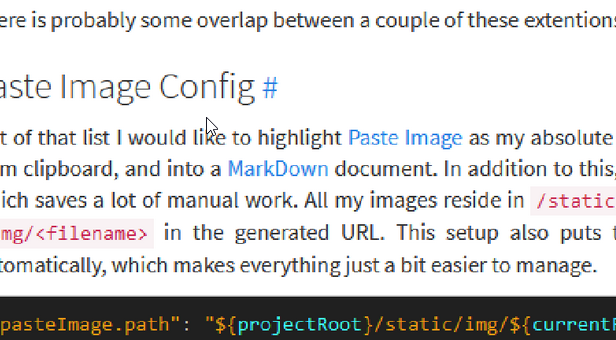

## Eine Überschrift
Dies ist ein Typoblindtext. An ihm kann man sehen,
ob alle Buchstaben da sind und wie sie aussehen.
Manchmal benutzt man Worte wie Hamburgefonts, Rafgenduks oder Handgloves, um Schriften zu testen. Manchmal Sätze, die alle Buchstaben des Alphabets enthalten – man nennt diese Sätze »Pangrams«. Sehr bekannt ist dieser: The quick brown fox jumps over the lazy old dog. Oft werden in Typoblindtexte auch fremdsprachige Satzteile eingebaut (AVAIL® and Wefox™ are testing aussi la Kerning), um die Wirkung in anderen Sprachen zu testen. In Lateinisch sieht zum Beispiel fast jede Schrift gut aus.
[Google](https://google.de)

Dies ist ein Typoblindtext. An ihm kann man sehen,
ob alle Buchstaben da sind und wie sie aussehen.
Manchmal benutzt man Worte wie Hamburgefonts, Rafgenduks oder Handgloves, um Schriften zu testen. Manchmal Sätze, die alle Buchstaben des Alphabets enthalten – man nennt diese Sätze »Pangrams«. Sehr bekannt ist dieser: The quick brown fox jumps over the lazy old dog. Oft werden in Typoblindtexte auch fremdsprachige Satzteile eingebaut (AVAIL® and Wefox™ are testing aussi la Kerning), um die Wirkung in anderen Sprachen zu testen. In Lateinisch sieht zum Beispiel fast jede Schrift gut aus.

Dies ist ein Typoblindtext. An ihm kann man sehen,
ob alle Buchstaben da sind und wie sie aussehen.
Manchmal benutzt man Worte wie Hamburgefonts, Rafgenduks oder Handgloves, um Schriften zu testen. Manchmal Sätze, die alle Buchstaben des Alphabets enthalten – man nennt diese Sätze »Pangrams«. Sehr bekannt ist dieser: The quick brown fox jumps over the lazy old dog. Oft werden in Typoblindtexte auch fremdsprachige Satzteile eingebaut (AVAIL® and Wefox™ are testing aussi la Kerning), um die Wirkung in anderen Sprachen zu testen. In Lateinisch sieht zum Beispiel fast jede Schrift gut aus.

## Zweite Überschrift
Dies ist ein Typoblindtext. An ihm kann man sehen, ob alle Buchstaben da sind und wie sie aussehen. Manchmal benutzt man Worte wie Hamburgefonts, Rafgenduks oder Handgloves, um Schriften zu testen. Manchmal Sätze, die alle Buchstaben des Alphabets enthalten – man nennt diese Sätze »Pangrams«. Sehr bekannt ist dieser: The quick brown fox jumps over the lazy old dog. Oft werden in Typoblindtexte auch fremdsprachige Satzteile eingebaut (AVAIL® and Wefox™ are testing aussi la Kerning), um die Wirkung in anderen Sprachen zu testen. In Lateinisch sieht zum Beispiel fast jede Schrift gut aus.
