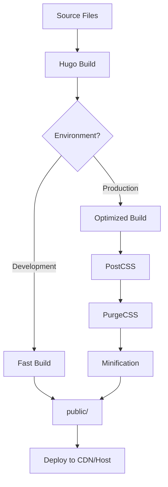

# Architecture Documentation - Article Time Blog

**Generated:** 2025-11-12
**Project:** Article Time
**Type:** Static Site Generator (Hugo)
**Live Site:** https://article-time.de
**Repository:** https://github.com/AngelCrawford/blog

---

## Executive Summary

Article Time is a bilingual (German/English) personal blog built with Hugo, a high-performance static site generator. The architecture follows JAMstack principles, delivering pre-rendered HTML files with client-side JavaScript enhancements for search and interactivity.

**Key Characteristics:**
- **Pattern:** JAMstack (JavaScript, APIs, Markup)
- **Rendering:** Build-time static generation
- **Content:** Markdown with YAML frontmatter
- **Styling:** SCSS with Bulma CSS framework
- **Optimization:** PostCSS with PurgeCSS for production
- **Deployment:** Static files (no server-side processing required)

**Architecture Goals:**
- ✅ Fast page load times (static HTML)
- ✅ SEO-friendly (pre-rendered content)
- ✅ Developer-friendly (Markdown content, live reload)
- ✅ Scalable (static files, CDN-ready)
- ✅ Secure (no server-side vulnerabilities)
- ✅ Bilingual support (German/English)

---

## Technology Stack

### Core Technologies

| Category | Technology | Version | Purpose |
|----------|-----------|---------|---------|
| **Static Site Generator** | Hugo Extended | v0.152.2 | Build system, templating, asset pipeline |
| **Template Engine** | Go Templates | Built-in | HTML template rendering |
| **Content Format** | Markdown | Goldmark | Content authoring |
| **Frontmatter** | YAML | Built-in | Content metadata |
| **CSS Framework** | Bulma | v1.0.4 | Responsive design system |
| **CSS Preprocessor** | SCSS/Sass | Built-in | Style authoring |
| **CSS Optimization** | PostCSS + PurgeCSS | v7.0.2 | Production CSS minification |
| **JavaScript Library** | jQuery | v3.x (vendored) | DOM manipulation |
| **Icons** | Remix Icon | Latest | Icon library (SVG sprites) |
| **Typography** | Google Fonts | - | Montserrat font family |
| **Package Manager** | npm | v6+ | Dependency management |
| **Version Control** | Git | v2+ | Source control |

### Development Tools

- **Primary Editor:** Windsurf
- **Image Editing:** GIMP (raster), Inkscape (vector)
- **Platform:** Windows (primary), cross-platform compatible

---

## Architecture Pattern: JAMstack

### JAMstack Principles

```
┌─────────────────────────────────────────────────┐
│                                                 │
│  J - JavaScript (Client-side enhancements)      │
│      └─> search.js, header.js, navbar.js       │
│                                                 │
│  A - APIs (External services, if any)           │
│      └─> None currently (potential: comments)   │
│                                                 │
│  M - Markup (Pre-rendered HTML)                 │
│      └─> Hugo-generated static files            │
│                                                 │
└─────────────────────────────────────────────────┘
```

### Build-Time Rendering

**Traditional CMS (WordPress):**
```
User Request → Server → PHP Processing → Database Query → HTML Generated → Response
```

**JAMstack (Hugo):**
```
Build Time: Content + Templates → Hugo → Static HTML Files
Runtime: User Request → CDN → Pre-rendered HTML → Fast Response
```

**Benefits:**
- No server-side processing at runtime
- No database queries
- Instant page loads
- Reduced attack surface
- Scalable via CDN
- Cost-effective hosting

---

## Content Architecture

### Content Model

```
Content Types:
├── Articles (Primary)
│   └── Leaf bundles (folder with index.md)
├── Logs (Development journal)
├── Authors (Profile pages)
├── Pages (Static pages)
└── Taxonomies
    ├── Categories
    ├── Tags
    ├── Series
    └── Authors
```

### Data Flow

```
1. Content Creation:
   Markdown (.md) + Frontmatter (YAML)
         ↓
2. Processing:
   Hugo Template Engine
         ↓
3. Rendering:
   HTML + CSS + JS
         ↓
4. Output:
   Static Files (public/)
```

### Frontmatter Schema

**Core Fields:**
- `title` - Article title (SEO optimized)
- `date` - Publication date
- `summary` - Article summary (required)
- `draft` - Publication status
- `categories`, `tags`, `series`, `authors` - Taxonomies

**SEO Parameters:**
- `params.SEO.desc` - Meta description
- `params.SEO.keywords` - Target keywords
- `params.SEO.canonicalURL` - Canonical URL

See `docs/data-models.md` for complete schema.

### Content Organization Pattern

**Page Bundles:**
```
content/articles/my-article/
├── index.md          # Content + frontmatter
├── cover.jpg         # Featured image
└── image1.png        # Inline images
```

**Benefits:**
- Self-contained units
- Co-located assets
- Easy to move/archive
- Clear organization

---

## Component Architecture

### Template Hierarchy

```
baseof.html (Base Layout)
    ├── head.html (HTML head)
    │   └── seo.html (SEO meta tags)
    ├── navigation.html (Main nav)
    ├── hero.html (Hero section)
    ├── {{ block "main" }}
    │   ├── home.html (Homepage)
    │   ├── list.html (List pages)
    │   │   └── card.html (Article cards)
    │   └── single.html (Single articles)
    └── footer.html (Site footer)
```

### Component Types

**Layouts** (22 templates):
- `baseof.html` - Base template (all pages extend)
- `home.html`, `list.html`, `single.html` - Page layouts
- `404.html` - Error page
- `_markup/` - Render hooks (images, links, headings)

**Partials** (reusable components):
- `_base/` - Core layout components (head, nav, footer, hero, seo)
- `widgets/` - Feature widgets (pagination, series, archive)
- `card.html` - Article card component

**Shortcodes** (content enhancements):
- `message.html` - Colored message boxes
- `rating.html` - Star ratings
- `tags.html` - Visual tag display
- `youtube.html` - YouTube embeds

See `docs/component-inventory.md` for complete catalog.

### JavaScript Architecture

**Module Pattern:**
```
jQuery-based modules (7 files):
├── main.js         # Core UI (back-to-top, footer reveal)
├── search.js       # Client-side search
├── header.js       # Dynamic header (time-based)
├── navbar.js       # Mobile navigation
├── gdpr.js         # Cookie consent
├── firework.js     # Special effects (seasonal)
└── suncalc.js      # Sunrise/sunset calculations
```

**State Management:**
- Search: In-memory index from `/index.json`
- GDPR: localStorage persistence
- Header: Time-based CSS class toggling
- Navigation: jQuery state management

**Note:** Potential modernization to vanilla JS documented in `docs/todo.md`.

---

## CSS/Style Architecture

### SCSS Structure (ITCSS-inspired)

```
assets/scss/
├── main.scss (Entry point)
├── vars/ (Variables, tokens)
├── src/bulma/ (Framework - 3rd party)
├── base/ (Base component styles)
├── elements/ (Element-specific styles)
└── layout/ (Layout compositions)
```

### Build Pipeline

```
SCSS Source
    ↓
Hugo SCSS Processor (Dart Sass)
    ↓
CSS Output
    ↓
PostCSS (production only)
    ↓
PurgeCSS (remove unused styles)
    ↓
Minified CSS
```

### Design System

**Typography:**
- Primary: Montserrat
- Secondary: Montserrat Alternates
- Source: Google Fonts (self-hosted)

**Icons:**
- Library: Remix Icon
- Format: SVG sprite system
- Usage: `<use xlink:href="...">`

**Layout:**
- Grid: Bulma's 12-column system
- Breakpoints: Bulma defaults (mobile-first)
- Container: Responsive max-widths

**Color System:**
- Defined in Bulma variables
- Time-based themes (dawn, day, dusk, night)
- Dynamic via `header.js` + `suncalc.js`

---

## Build & Deployment Architecture

### Build Process



**Build Commands:**
- Development: `hugo server` (live reload)
- Production: `hugo --environment production` (optimized)

**Build Output:**
- Location: `public/` folder
- Contents: Static HTML, CSS, JS, images, fonts
- Deployable: Anywhere (CDN, static host, S3, etc.)

### Multi-Environment Configuration

```
config/
├── _default/     # Base configuration
├── development/  # Dev overrides (drafts visible)
└── production/   # Prod overrides (PurgeCSS enabled)
```

**Environment switching:**
```bash
hugo server --environment production
```

### Asset Pipeline

**SCSS:**
```
assets/scss/main.scss
    → Hugo (Dart Sass)
    → resources/_gen/ (cache)
    → PostCSS (prod)
    → public/css/
```

**JavaScript:**
```
assets/js/*.js
    → Hugo bundling
    → public/js/
```

**Images:**
```
content/*/image.jpg
    → Hugo image processing
    → WebP conversion
    → Resizing (responsive)
    → public/images/
```

### Deployment Strategy

**Current:** Manual deployment (build + upload `public/`)

**Recommended Options:**
1. **Netlify** - Git-based auto-deploy (recommended)
2. **Vercel** - Similar to Netlify
3. **GitHub Pages** - Free static hosting
4. **Traditional Host** - FTP/SFTP of `public/`

**No CI/CD configuration found** - Deployment is currently manual.

---

## Data Architecture

### Search Index

**Generation:**
```
Build time → Hugo → index.json → public/
```

**Structure:**
```json
[
  {
    "title": "Article Title",
    "showTitle": "Display Title",
    "content": "Full content for searching",
    "showContent": "Excerpt for display",
    "permalink": "/articles/slug/",
    "tags": "tag1, tag2",
    "categories": "Category",
    "publishedOn": "date",
    "updatedOn": "date"
  }
]
```

**Usage:**
- Loaded by `search.js` at search initiation
- Client-side full-text search
- German stopwords filtering
- Weight-based ranking

**Performance Consideration:**
- Index grows with content (currently ~31 articles)
- Loaded only when search is triggered
- No pagination (shows top 30 results)

See `docs/todo.md` for optimization recommendations.

### Taxonomies

**Configured in config.yaml:**
```yaml
taxonomies:
  category: categories
  tag: tags
  author: authors
  series: series
```

**Relationships:**
```
Article
  ├──> Categories (1 primary)
  ├──> Tags (multiple)
  ├──> Authors (multiple)
  └──> Series (multiple)
```

**Generated Pages:**
- List pages for each taxonomy term
- Automatic relationship links
- Related content suggestions

### Git Integration

```yaml
enableGitInfo: true
frontmatter:
  lastmod: ["lastmod", ":git", "date"]
```

**Behavior:**
- Hugo reads Git history
- Auto-populates `lastmod` from commits
- Fallback chain: manual → Git → `date` field

---

## Testing Strategy

### Current Testing Approach

**Manual Testing:**
- Visual inspection of pages
- Responsive design testing
- Cross-browser compatibility
- SEO validation (meta tags, structured data)

**No Automated Tests Found**

### Recommended Testing

**Build Validation:**
- Hugo build completes without errors
- No broken links
- All templates render
- Search index generates

**Content Validation:**
- Frontmatter schema compliance
- Required fields present
- Valid YAML syntax

**Performance Testing:**
- Page load speed
- CSS size (PurgeCSS effectiveness)
- Image optimization

**SEO Testing:**
- Meta tag presence
- Open Graph tags
- Structured data validation
- Sitemap generation

---

## Security Considerations

### JAMstack Security Benefits

✅ **No server-side vulnerabilities:**
- No PHP/Python/Ruby execution
- No database to attack
- No admin panel to compromise

✅ **Reduced attack surface:**
- Static files only
- No dynamic processing
- No user input on server

### Security Headers

Configured in `config/_default/config.yaml`:

```yaml
server:
  headers:
    "/**":
      X-Content-Type-Options: "nosniff"
      X-Frame-Options: "DENY"
      X-XSS-Protection: "1; mode=block"
      Referrer-Policy: "strict-origin-when-cross-origin"
      Permissions-Policy: "camera=(), microphone=(), geolocation=()"
```

### Content Security

- **Git-based:** All changes versioned
- **No database:** No SQL injection risk
- **Static output:** No code execution vulnerabilities

### Client-Side Considerations

⚠️ **jQuery dependency:** Consider security updates
⚠️ **No CSP headers:** Content Security Policy not implemented yet

See `docs/todo.md` for CSP configuration task.

---

## Performance Characteristics

### Build Performance

- **Small site (31 articles):** ~2-5 seconds
- **Incremental builds:** Very fast (< 1 second)
- **Live reload:** Near-instant (<1 second)

### Runtime Performance

**Static HTML Benefits:**
- Instant page loads (no server processing)
- CDN-friendly (cacheable)
- Low bandwidth (optimized assets)

**CSS Optimization:**
- PurgeCSS removes unused styles
- Production CSS significantly smaller
- Safelist for dynamic classes

**Image Optimization:**
- WebP conversion (modern format)
- Responsive images (srcset)
- Lazy loading potential

### Performance Metrics (Expected)

- **First Contentful Paint:** < 1s (CDN)
- **Time to Interactive:** < 2s
- **Total Page Size:** < 500KB (optimized)

---

## Scalability

### Content Scalability

**Current:** ~31 articles
**Expected Capacity:** 1000+ articles without issues

**Hugo Performance:**
- Very fast build times (Go-based)
- Handles thousands of pages efficiently
- Parallel processing

### Asset Scalability

**Images:**
- Hugo image processing is efficient
- Consider external CDN for thousands of images

**CSS:**
- PurgeCSS keeps size minimal
- Scales well with content growth

**Search:**
- Client-side search has limits
- Consider server-side search at ~500+ articles
- Options: Algolia, Lunr.js, Pagefind

### Hosting Scalability

**Static files = infinite scalability:**
- CDN distribution
- No server load
- Pay only for bandwidth

---

## Extensibility

### Adding Features

**New Content Types:**
1. Create archetype in `archetypes/`
2. Add taxonomy if needed (config.yaml)
3. Create layout in `layouts/`

**New Components:**
1. Add partial in `layouts/_partials/`
2. Reference in templates
3. Style in `assets/scss/`

**New Shortcodes:**
1. Create in `layouts/_shortcodes/`
2. Document usage
3. Use in content: ``

### Integration Points

**Potential Integrations:**
- **Comments:** Disqus, Commento, utterances
- **Analytics:** Google Analytics, Plausible, Fathom
- **Search:** Algolia, Lunr.js, Pagefind
- **Newsletter:** Mailchimp, ConvertKit
- **Forms:** Netlify Forms, Formspree

**Current Integrations:** None (pure static)

---

## Technical Debt

See `docs/todo.md` for detailed list.

**High Priority:**
1. **jQuery migration:** Modern vanilla JS
2. **CSP implementation:** Content Security Policy
3. **Performance optimization:** Search index handling

**Medium Priority:**
1. **Error pages:** 500, 403, etc.
2. **Font loading:** Add `font-display: swap`
3. **CSS cleanup:** Remove `!important` from universal selector

**Low Priority:**
1. **Design system:** Token-based system
2. **Automated testing:** Build validation
3. **CI/CD:** Automated deployment

---

## Architecture Decisions

### Why Hugo?

✅ **Speed:** Fastest static site generator (Go-based)
✅ **No dependencies:** Single binary, no Ruby/Python/Node runtime
✅ **Built-in features:** Image processing, SCSS, templating
✅ **Content organization:** Page bundles, taxonomies
✅ **Active community:** Large ecosystem, good documentation

### Why Bulma CSS?

✅ **Modern:** Flexbox-based, responsive
✅ **Modular:** Import only what you need
✅ **No JavaScript:** Pure CSS framework
✅ **Good documentation:** Easy to learn
✅ **Customizable:** SCSS variables

### Why jQuery?

⚠️ **Historical:** Site started with jQuery
⚠️ **Functional:** Works well for current needs
🔄 **Under review:** Consider vanilla JS migration (see `docs/todo.md`)

### Why Client-Side Search?

✅ **No server:** Keeps architecture static
✅ **Instant results:** No API latency
✅ **Privacy:** No data sent to third parties
⚠️ **Scalability:** Limited to ~500 articles
🔄 **Future:** May migrate to Algolia/Pagefind if needed

---

## Future Considerations

### Planned Improvements

1. **Modernize JavaScript:**
   - Remove jQuery dependency
   - Use vanilla JS or lightweight library
   - Reduce bundle size (~30KB savings)

2. **Enhanced Search:**
   - Lazy-load search index
   - Consider Algolia or Pagefind
   - Add search result pagination

3. **Performance Optimization:**
   - Implement lazy loading for images
   - Add service worker for offline support
   - Optimize font loading strategy

4. **Content Features:**
   - Add comment system (utterances or similar)
   - Newsletter integration
   - Social sharing improvements

### Architectural Evolution

**Phase 1 (Current):**
- Pure static JAMstack
- No external services
- Manual deployment

**Phase 2 (Planned):**
- Automated CI/CD (Netlify/Vercel)
- Enhanced search (external service)
- Modern JavaScript (no jQuery)

**Phase 3 (Future):**
- Progressive Web App (PWA)
- Advanced caching strategies
- Headless CMS integration (optional)

---

## Conclusion

Article Time implements a robust, scalable JAMstack architecture using Hugo. The build-time rendering approach delivers excellent performance, security, and developer experience. While there are opportunities for modernization (jQuery removal, enhanced search), the current architecture effectively serves the blog's needs with minimal complexity and maximum speed.

**Strengths:**
- Fast build times and page loads
- Simple deployment (static files)
- Excellent SEO (pre-rendered content)
- Developer-friendly (Markdown, live reload)
- Secure (no server-side execution)

**Areas for Improvement:**
- JavaScript modernization
- Search scalability
- Automated testing
- CI/CD implementation

The architecture is well-suited for a personal blog and can scale to hundreds or thousands of articles with minimal modifications.
